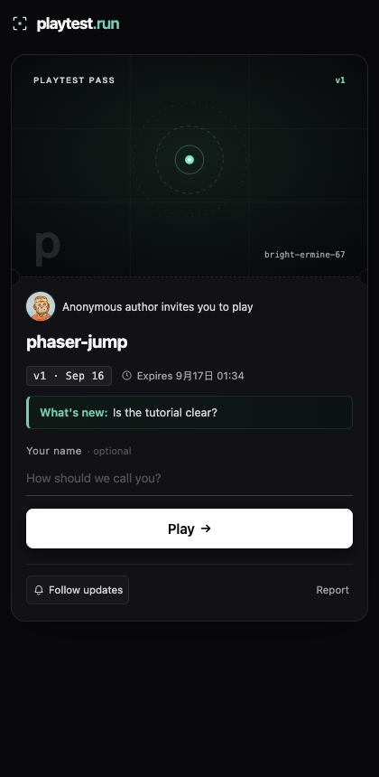

# 2026-09-16 · 英文版上线，v0.4.0 发布

日期：2026-09-16 01:15 – 01:40 CST。环境：macOS arm64 本机部署到香港生产机（`playtest-hk`，arm64，1.8 GB 内存），无头 Chrome 对线上复验。接 `2026-09-16-english-only-product-and-two-real-machine-bugs.md`。

## 生产机 SSH 恢复了

之前几个小时稳定失败在 `kex_exchange_identification: Connection closed by remote host`（TCP 22 可达、站点 200），本轮直接连上，没做任何操作。机器状态：`up 8 days`，负载 0.00，根分区 51%，内存 1835 MB 用 577 MB。最可能是 fail2ban 临时封了本机出口 IP 后自动解封——没有登上去查 `fail2ban` 日志确认，属于推测。

## 部署

从一个干净的 `git worktree`（detached 在 `6945e40`）跑 `deploy/push.sh`，不用主工作区——主工作区里有另一个会话未提交的控制台改动，`push.sh` 是 rsync 工作区而不是 HEAD，从 worktree 部署才能保证上线的就是 CI 验过的那份。

服务器上构建三个镜像（server 2m20s、caddy 5s、console 11s），`docker compose up -d` 重建四个容器，api 与 edge 的 `/healthz` 都返回 `ok`。标签 `20260915-171628`。

## 线上复验（都是真机，不是推断）

- `skill.md` 的 Install 段已经是 `curl -fsSL https://playtest.run/install.sh | bash`，不再指向 Releases。
- 作品页 `playtest.run/p/scarlet-salmon-48`：`class="chat-prompt"` 与 `.chat-prompt{` 同时存在（修复前只有前者）；轮询取址已是 `chatForm.getAttribute('action')`。
- 无头 Chrome 打开该页并点开 Voices 面板：界面文案全英文（`ouyz invites you to test`、`Your name · optional`、`Test`、`Follow updates`、`Voices`、`The author wants to know:`、六个英文贴纸），**console 数组为空**——生产上每次轮询 503 的问题确认消失。页面里剩下的中文是作者自己写的作品名与简介，属于用户内容。
- 广场 `playtest.run/`：导航与文案全英文，console 为空。

## v0.4.0

线上验完发现最后一个缺口：`v0.3.0` 的二进制是翻译**之前**打的，所以陌生人装完得到的是英文安装脚本 + 中文 CLI。把 `cli` 版本推到 0.4.0、`install.sh` 的兜底版本一并更新，打 `v0.4.0`。

五个 target 全绿，**R2 上传步骤这次自动跑通了**——`2026-09-15` 那条 spike 里记的三个 release 工作流 bug（`if` 引用 step-level env 永远为假、release job 没 checkout、不生成 `VERSION`）修复后第一次真正执行，7 个文件逐一 CDN 回读且 SHA-256 一致，`dl.roviix.com/files/VERSION` 现为 `v0.4.0`。以前每次都要手传。

## 陌生人闭环（空 HOME，全新安装）

```
$ curl -fsSL https://playtest.run/install.sh | bash
Installed playtest v0.4.0 to …/.local/bin/playtest
$ playtest . --no-qr -m "Is the tutorial clear?"
Looks like a Phaser build
All 2 files are already on the server. Nothing to upload.
Published "phaser-jump" v1

https://playtest.run/p/bright-ermine-67

Anonymous link, expires 2026-09-17 01:34. Run playtest login to keep it.
See how people played in the Developer Console: https://playtest.run/console/#/s/bright-ermine-67
```

`/p/<slug>`、子域、`card.png` 全部 200；浏览器渲染的邀请页见下图，console 为空；`playtest rm -y` 后子域 404。



## 没验的

- 仍然没有第二个人用过：所有验证都是作者本机发起的。
- 没有 Windows、Linux 真机；没有手机真机扫码。
- 邮件没有真的投递到收件箱，只在 `email_preview` 里看过渲染。
- 没有海外网络实测，边缘仍在香港（DESIGN §4.4 已标注这对英文首发不是最优解）。
- 没查清 SSH 之前为什么不通，只是恢复了。
- 头像素材物种名仍是中文，在 SVG 的 `data-creature` 属性里；改名会让固定种子金样哈希失效，留作待办。
