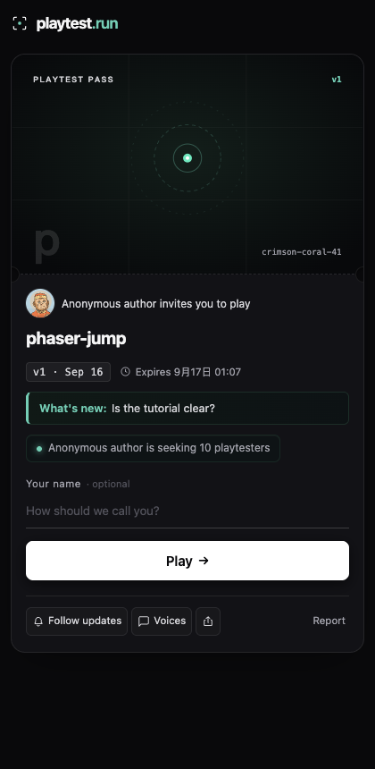
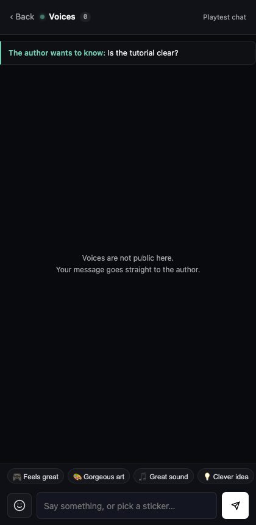

# 2026-09-16 · 对外全英文之后，真机走一遍玩家路径

日期：2026-09-15 20:00 – 2026-09-16 01:10 CST。环境：macOS arm64 本机，`scripts/dev-unified.mjs` 起的完整本地栈（api + edge + 控制台 + 假 GitHub），无头 Chrome（`--headless=new`，420×860 视口，系统语言中文）。接 `2026-09-15-public-release-v0.3.0-and-language-gap.md`。

## 做了什么

按 DESIGN §1.5 定的「对外只有英文、不做 i18n」，把 CLI、共享层、玩家页与内联脚本、控制台、SDK、API 与通知邮件、安装脚本、落地页的用户可见文案全部改成英文。仓库内部的设计文档、代码注释、spike、`tracing` 日志、测试里的断言消息与夹具数据保持中文。

全量 `cargo test --workspace --locked` 35 个 target 全绿；`cargo fmt --all --check` 与 `cargo clippy --workspace --all-targets --features playtest-common/tunnel-io -- -D warnings` 干净；`console` 与 `sdk` 的 `pnpm build` 在一个干净 worktree 里从入库状态复验通过，`sdk/dist/playtest.js` 与源码一致（6423 字节，gzip 3047，上限 4096）。

## 真机验到的

本机匿名发布 `fixtures/phaser-jump/export`，带 `-m "Is the tutorial clear?" --public --seats 10`，CLI 输出全英文：

```
Reading .: 2 files, 1.1 MB
Looks like a Phaser build
Published "phaser-jump" v1
On the Plaza, marked seeking testers: http://localhost:48550/
Looking for 10 testers, said on the invitation page and the invite card; anyone who leaves a name counts as joined
Anonymous link, expires 2026-09-17 01:02. Run playtest login to keep it.
```

浏览器打开邀请页与 Voices 面板，文案与排版见截图。到期时间那行是浏览器按访客语言本地化的（本机系统中文，所以显示 `9月17日 01:07`）——这是 `toLocaleString(undefined, …)` 的预期行为，不是漏翻；无脚本兜底那串是 `Sep 17, 01:02 (UTC+8)`。





## 真机才暴露的三个缺陷，都已修

单元测试与 `curl` 都没抓到这三个，要浏览器真的渲染并执行脚本才看得见。

1. **聊天轮询一直 503，生产同样中招。** `ui/dialog.js` 用 `chatForm.action` 取轮询地址，而表单里有 `<input type="hidden" name="action" value="feedback">`；按 DOM 具名属性规则，它遮蔽了表单自己的 `action`，读到的是 input 元素本身，拼出来是 `/p/[object HTMLInputElement]?chat=1`。改成 `getAttribute('action')`。线上 `playtest.run/p/scarlet-salmon-48` 的 HTML 里同样有那个隐藏域，说明每个作品页的 Voices 轮询都坏着——部署之后才会修好。加了一条守卫测试盯着别再写回 `chatForm.action`。
2. **到期那行写了两遍 Expires。** HTML 是 `<span>Expires <time>…</time></span>`，本地化脚本又给 `<time>` 赋了 `'Expires ' + 本地时间`，渲染成 `Expires Expires 9月17日 01:07`。脚本只改时间本身。
3. **「作者想问」那块在网页作品页上没有样式。** `.chat-prompt` 的三条规则只在 `ui/presentation.css` 里，而那份样式只在 `kind != Web` 时内联——也就是说文章和视频页正常，最常见的游戏页裸奔。线上 `scarlet-salmon-48` 输出了 `class="chat-prompt"` 却没有 `.chat-prompt{`，确认属实。把这三条挪出来，在真有那句话且有聊天面板时随页面注入（383 字节），邀请页的 16 KB 预算还剩 371 字节，所以不能无条件放进公共样式表。

## 没验的

- 线上仍是旧的中文版本：`ssh playtest-hk` 稳定失败在 `kex_exchange_identification: Connection closed by remote host`（`nc` 测 22 端口 TCP 可达，站点本身 200），`deploy/push.sh` 跑不了。上面三个修复和全部英文文案都还没到生产。
- 没有 Windows、Linux 真机；没有手机真机扫码；仍然没有第二个人用过。
- 邮件只在 `email_preview` 里看过渲染，没有真的投递到收件箱。
- 头像素材的物种名仍是中文（`街头猿`、`蘑菇居民`），出现在 SVG 的 `data-creature` 属性里，不是渲染文本。改名会让 `common/tests/avatar-vectors.json` 的固定种子金样哈希失效，那道守卫是防画稿被无声改动的，没有为一个不可见属性去重算，留作待办。
